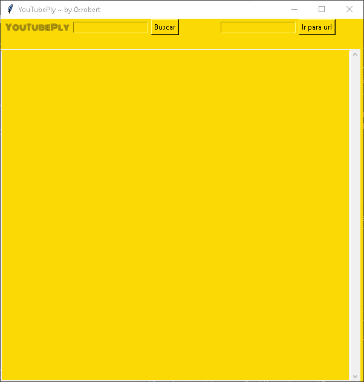
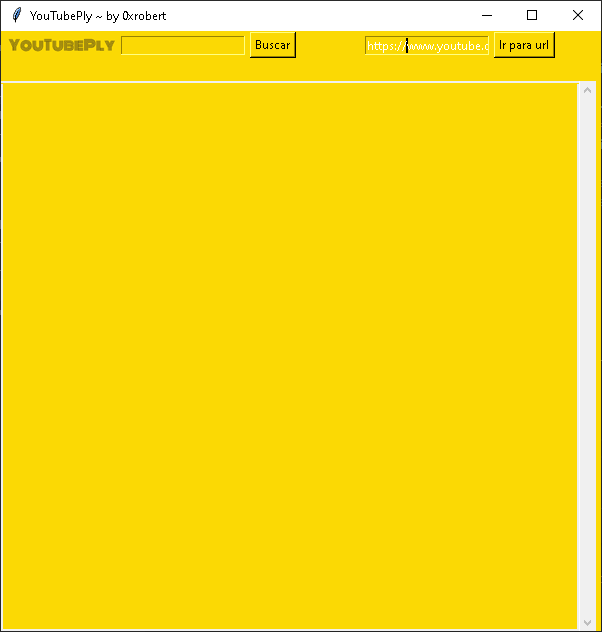

# Youtube Ply




> Irritante esse novo anti-adblock do youtube, né? Aqui tem uma solução, meio simplista? Sim! Mas funciona!

### Ajustes e melhorias

O projeto ainda está em desenvolvimento e as próximas atualizações serão voltadas nas seguintes tarefas:

- [ ] Adicionar toolbar com opções
- [ ] Adicionar opção de voltar, e avançar
- [ ] Adicionar opção de abrir video direto no navegador
- [ ] Adicionar opção de abrir video em outros players

## 💻 Pré-requisitos

Antes de começar, verifique se você atendeu aos seguintes requisitos:

### Windows & MAC

* Você instalou a versão mais recente de [Python](https://www.python.org/downloads/)

### Linux

```
sudo apt-get install python
```


## 🚀 Instalando YouTubePly

Para instalar o YouTubePly, siga estas etapas:

### Linux, macOS e Windows:

Navegue até a pasta do repositório e execute:
```
pip install -r requirements.txt
```

## ☕ Usando YouTubePly

Para usar YouTubePly, basta executa-lo da seguinte maneira:
Navegue até o local do script, e execute:

```
python main.py
```

Após executar o script, está tela será aberta:


Para procurar palavras-chaves, utilize o campo de pesquisa:


Para colar o url de algum video direto, utilize o campo do url:



E por fim, o video escolhido, será aberto no vlc, como na imagem a seguir:


Divirta-se ;D

## 📫 Contribuindo para YouTubePly

Para contribuir com YouTubePly, siga estas etapas:

1. Bifurque este repositório.
2. Crie um branch: `git checkout -b <nome_branch>`.
3. Faça suas alterações e confirme-as: `git commit -m '<mensagem_commit>'`
4. Envie para o branch original: `git push origin <nome_do_projeto> / <local>`
5. Crie a solicitação de pull.

Como alternativa, consulte a documentação do GitHub em [como criar uma solicitação pull](https://help.github.com/en/github/collaborating-with-issues-and-pull-requests/creating-a-pull-request).

## 😄 Seja um dos contribuidores

Quer fazer parte desse projeto? Clique [AQUI](CONTRIBUTING.md) e leia como contribuir.

## 📝 Licença

Esse projeto está sob licença. Veja o arquivo [LICENÇA](LICENSE.md) para mais detalhes.